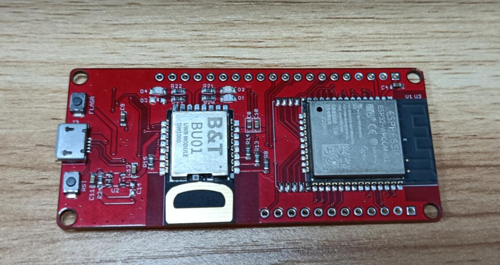
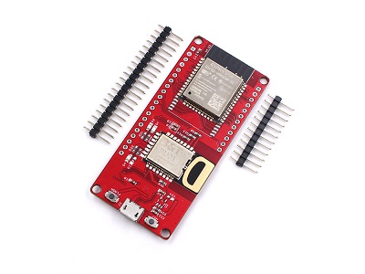
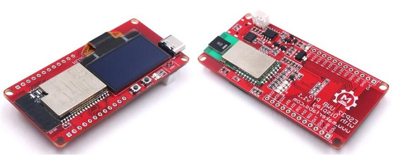
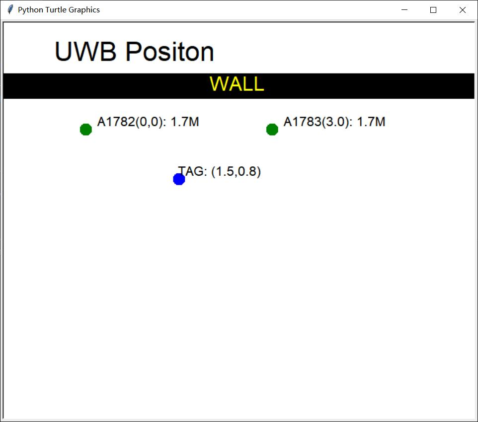

# Makerfabs ESP32 UWB & Display

```c++
/*
Version:		V4.3
Author:			Vincent
Create Date:	2021/11/6
Note:
	2021/12/9 	V2.0:Add a Indoor Positioning demo.
	2022/6/29 	V2.1:Add DW3000 library.
	2022/8/1  	V3.0:Provides a library available for high-power versions. Move DW3000 to other 		  					     repositories.
	2022/9/6	V3.1:Added changes to the high-power version.
	2022/10/26 	V4.0:Add new version with SSD1306
	2022/11/15	V4.1:Change library name to mf_DW1000.zip
	2022/12/29	V4.2: Change wiki link
	2023/1/3	V4.3: Change directory name.
*/
```



[toc]

# Makerfabs

[Makerfabs home page](https://www.makerfabs.com/)

[Makerfabs Wiki](https://wiki.makerfabs.com/)

# Makerfabs ESP32 UWB Serials
## Intruduce


ESP32 UWB : [esp32-uwb-ultra-wideband](https://www.makerfabs.com/esp32-uwb-ultra-wideband.html) 

ESP32 UWB Pro : [esp32-uwb-high-power](https://www.makerfabs.com/esp32-uwb-high-power-120m.html)

ESP32 UWB Pro with Display : [ESP32 UWB Pro with Display](https://www.makerfabs.com/esp32-uwb-pro-with-display.html)

Wiki Link : [ESP32 UWB Pro with Display](https://wiki.makerfabs.com/ESP32_UWB_Pro_with_Display.html) 


Ultra-wideband (UWB) is a short-range, wireless communication protocol that operates through radio waves, enables secure reliable ranging and precision sensing, creating a new dimension of spatial context for wireless devices.

This new ESP32 UWB pro with display is the updated version of ESP32 UWB Pro, with the following new spec:

- On-board OLED, 1.3” 128*64, so the distance results can be directly displayed
- Lipo battery charger& connector, so this module can work separately with batteries
- Update UWB position, so the module can be directly installed into a case


| | **UWB Basic** | **UWB Pro** | **UWB Pro with Display** | **UWB DW3000** |
| --------------------- | ------------------------------------------------------------ | ------------------------------------------------------------ | ------------------------ | ------------------------------------------------------------ |
| CPU                   | ESP32-WROOM/WROVER                                           | ESP32-WROVER                                                 | ESP32-WROVER             | ESP32-WROOM/WROVER                                           |
| Core UWB              | DW1000                                                       | DW1000                                                       | DW1000                   | DW3000                                                       |
| Screen                | N                                                            | N                                                            | Y                        | N                                                            |
| Measuring distance(m) | 45                                                           | 200                                                          | 200                      | 20                                                           |
| Battery Socket        | N                                                            | N                                                            | Y                        | N                                                            |
| UWB Channel           | 2/5                                                          | 2/5                                                          | 2/5                      | 5/9                                                          |
| Apple Interoperable   | N                                                            | N                                                            | N                        | Y                                                            |
| Suitable for          | Normal Testing                                               | Long distance needed                                         | Long distance needed     | Product development                                          |


### UWB Basic




### UWB Pro


### UWB Pro with Display




# Example

## Compiler Options

**If you have any questions，such as how to install the development board, how to download the code, how to install the library. Please refer to :[Makerfabs_FAQ](https://github.com/Makerfabs/Makerfabs_FAQ)**

- Install board : ESP32 .
- Rename mf_DW1000.zip to DW1000.zip and install it.
- Install library : Adafruit_SSD1306
- Upload code, select board "ESP32 DEV"

**This library was modified from the [DW1000](https://github.com/thotro/arduino-dw1000) library to work with the Makerfabs hardware. **

**Please download the latest version from our Github.**


## Example List

### uwb_tag

*For ESP32 UWB and ESP32 UWB Pro*

Distance to the receiving end of the test. You need an anchor point to receive data.

### uwb_tag_display

*For ESP32 UWB Pro with display*

Distance to the receiving end of the test. You need an anchor point to receive data.

### anchor

*For ESP32 UWB and ESP32 UWB Pro*

Distance test anchor point.

### anchor_display

*For ESP32 UWB Pro with display*

Distance test anchor point.


### Indoor positioning

*For ESP32 UWB and ESP32 UWB Pro*

Three UWB modules were used for indoor plane positioning. Data is transmitted through UDP protocol and graphically displayed in Python. 



The law of cosines is used to calculate tag coordinates.

```python
def tag_pos(a, b, c):
    # p = (a + b + c) / 2.0
    # s = cmath.sqrt(p * (p - a) * (p - b) * (p - c))
    # y = 2.0 * s / c
    # x = cmath.sqrt(b * b - y * y)
    cos_a = (b * b + c*c - a * a) / (2 * b * c)
    x = b * cos_a
    y = b * cmath.sqrt(1 - cos_a * cos_a)

    return round(x.real, 1), round(y.real, 1)
```


## Pin Define

### ESP32 UWB and ESP32 UWB Pro

```c++
#define SPI_SCK 18
#define SPI_MISO 19
#define SPI_MOSI 23

#define DW_CS 4
#define PIN_RST 27
#define PIN_IRQ 34
```

### ESP32 Pro with display

```c++
#define SPI_SCK 18
#define SPI_MISO 19
#define SPI_MOSI 23

#define UWB_SS 21   // spi select pin
#define UWB_RST 27  // reset pin
#define UWB_IRQ 34  // irq pin

#define I2C_SDA 4	//I2C screen ssd1306
#define I2C_SCL 5
```

