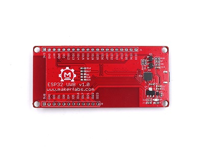
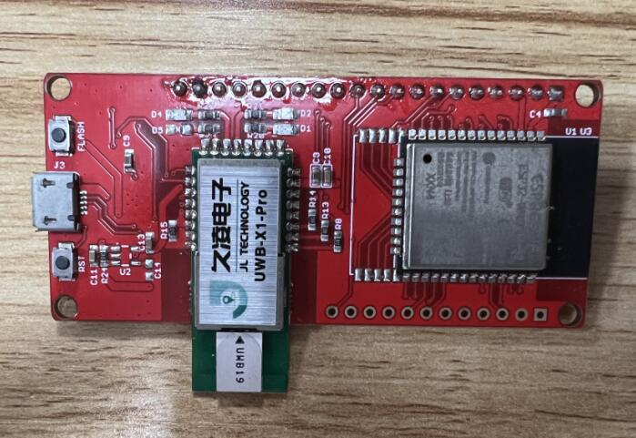
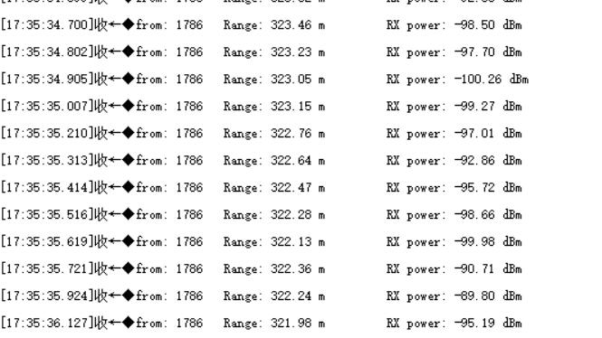
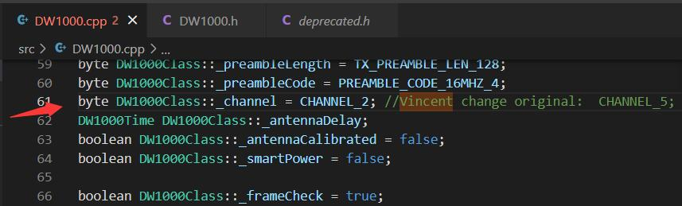
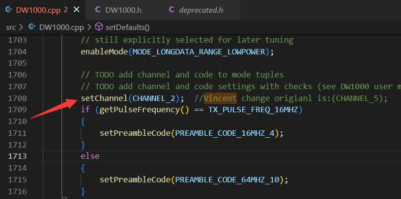

# Makerfabs ESP32 UWB

```c++
/*
Version:		V3.0
Author:			Vincent
Create Date:	2021/11/6
Note:
	2021/12/9 	V2.0:Add a Indoor Positioning demo.
	2022/6/29 	V2.1:Add DW3000 library.
	2022/8/1  	V3.0:Provides a library available for high-power versions. Move DW3000 to other 		  					     repositories.
	2022/9/6	V3.1:Added changes to the high-power version.

*/
```


[toc]

# Makerfabs

[Makerfabs home page](https://www.makerfabs.com/)

[Makerfabs Wiki](https://makerfabs.com/wiki/index.php?title=Main_Page)

# Makerfabs ESP32 UWB
## Intruduce

Product Link ：[esp32-uwb-ultra-wideband](https://www.makerfabs.com/esp32-uwb-ultra-wideband.html) 

Wiki Link : [ESP32_UWB](https://www.makerfabs.com/wiki/index.php?title=ESP32_UWB) 

Makerfabs ESP32 UWB contains an ESP32 and a DW1000 chip.

The DW1000 is a single-chip wireless transceiver based on ultra-wideband technology. The chip enables you to develop cost-effective RTLS solutions that can pinpoint indoor and outdoor positioning to within 10 cm.

The chip provides a new approach to real-time location and indoor location systems, location-based services, wireless sensor networks and the Internet of Things by providing accurate location awareness and communication.

UWB - X1 - PRO module is our decaWave DW1000 chip design company based UWB transceiver module products. After the encapsulation All compatible DWM1000, pin pin to pin, can directly replace to use. The antenna is integrated in the module and all of the rf circuit, power management and clock circuit is equal to one.

Based on our actual tests, the range range of the standard DW1000 is around 47 meters, and the long-distance version can reach 125 meters. Of course, it depends on the test environment.


## Feature

- Integrated ESP32 2.4G WiFi and Bluetooth.
- DW1000 UWB module.
- UWB - X1 - PRO module.(Long range)


### Front:


### Back:


### Long Range Version UWB-X1-Pro




# Example

## Equipment list


- At least two ESP32 UWB


## Compiler Options

**If you have any questions，such as how to install the development board, how to download the code, how to install the library. Please refer to :[Makerfabs_FAQ](https://github.com/Makerfabs/Makerfabs_FAQ)**

- Install board : ESP32 .
- Install library : arduino-dw1000
- Change code in DW1000.cpp

```c++
void DW1000Class::begin(uint8_t irq, uint8_t rst) {
	// generous initial init/wake-up-idle delay
	delay(5);
	// Configure the IRQ pin as INPUT. Required for correct interrupt setting for ESP8266
    	pinMode(irq, INPUT);
	// start SPI
	SPI.begin();

// Change By VINCENT
// #ifndef ESP8266
// 	SPI.usingInterrupt(digitalPinToInterrupt(irq)); // not every board support this, e.g. ESP8266
// #endif

	// pin and basic member setup
	_rst        = rst;
	_irq        = irq;
	_deviceMode = IDLE_MODE;
	// attach interrupt
	//attachInterrupt(_irq, DW1000Class::handleInterrupt, CHANGE); // todo interrupt for ESP8266
	// TODO throw error if pin is not a interrupt pin
	attachInterrupt(digitalPinToInterrupt(_irq), DW1000Class::handleInterrupt, RISING); // todo interrupt for ESP8266
}
```

Comment out these code, or a compilation error will occur.

```c++
// #ifndef ESP8266
// 	SPI.usingInterrupt(digitalPinToInterrupt(irq)); // not every board support this, e.g. ESP8266
// #endif
```

- Upload code, select board "ESP32 DEV"


**V3.0 Update**

Modify by [DW1000](https://github.com/thotro/arduino-dw1000) version 0.9.0

Provides a library available for high-power versions. It is also compatible with the standard DW1000, and in fact only adds an initialization function for the high-power version. Of course, it also includes the changes above.

 

```c++

// Vincent changes
// For large power moudle
void DW1000Class::large_power_init()
{
	// uint32 reg;
	// reg = dwt_read32bitreg(GPIO_CTRL_ID);
	// reg |= 0x00014000;
	// reg |= 0x00050000;
	// dwt_write32bitreg(GPIO_CTRL_ID, reg);
	// dwt_write16bitoffsetreg(PMSC_ID, PMSC_TXFINESEQ_OFFSET, PMSC_TXFINESEQ_DISABLE);

	byte reg[4];

	readBytes(GPIO_CTRL, 0, reg, 4);

	reg[1] |= 0x40;
	reg[2] |= 0x01;
	reg[2] |= 0x05;

	writeBytes(GPIO_CTRL, 0, reg, 4);

	reg[0] = reg[1] = reg[2] = reg[3] = 0;
	writeBytes(PMSC, 0x26, reg, 2);

	reg[0] = 0xC0;
	reg[1] = 0;
	reg[2] = 0;
	reg[3] = 0;
	writeBytes(TX_CAL, TC_PGDELAY_SUB, reg, 1);

	reg[0] = 0x1f;
	reg[1] = 0x1f;
	reg[2] = 0x1f;
	reg[3] = 0x1f;
	writeBytes(TX_POWER, 0, reg, 4);
}
```


**V3.1 Update**

By changing the channel from Channel5 to Channel2, the distance of UWB-X1-Pro can reach 320M.



This is due to the fact that the X1-Pro's antenna is optimized for Channel2.

But Makerfabs could not provide further technical support, just suggestions from suppliers.

If you're interested, try DW1000_channel2.zip, or make changes directly in the DW1000 library code.






## Example List

### Anchor

Distance test anchor point.

### Tag

Distance to the receiving end of the test. You need an anchor point to receive data.

### Tag_1306

There is an SSD1306 screen receiver, and a data structure for storing multiple anchor points is implemented. (The screen can display a maximum of two anchors, you can modify the font size to show more anchors). You need an anchor point to receive data.


### Indoor positioning

Three UWB modules were used for indoor plane positioning. Data is transmitted through UDP protocol and graphically displayed in Python. 


The law of cosines is used to calculate tag coordinates.

```python
def tag_pos(a, b, c):
    # p = (a + b + c) / 2.0
    # s = cmath.sqrt(p * (p - a) * (p - b) * (p - c))
    # y = 2.0 * s / c
    # x = cmath.sqrt(b * b - y * y)
    cos_a = (b * b + c*c - a * a) / (2 * b * c)
    x = b * cos_a
    y = b * cmath.sqrt(1 - cos_a * cos_a)

    return round(x.real, 1), round(y.real, 1)
```


## Code Explain

- Define Pins

```c++
#define SPI_SCK 18
#define SPI_MISO 19
#define SPI_MOSI 23
#define DW_CS 4

// connection pins
const uint8_t PIN_RST = 27; // reset pin
const uint8_t PIN_IRQ = 34; // irq pin
const uint8_t PIN_SS = 4;   // spi select pin
```

